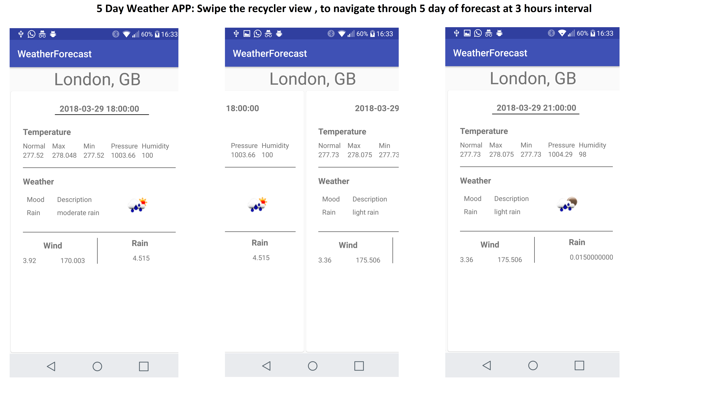

# WeatherForecast

Technologies Implemented:  
Activity, Fragment
MVP
RecyclerView
Butterknife
CardView
Retrofit, RxJava
Picasso

How to Run/Build  
Clone the source code 
Import to Android Studio 
Build and Run 
 

To be Implemented/Wishlist  
-Search View to search by city or Zip Code  
-Integrate Google maps to get the current location, or navigate to custom location, and display related weather details  
-Advance UI, and Animations. Icons , themes  
-API returns the date every 3 hours. Combine this, and return an average temp for each day.  
-Or,Separate the Date by days, rather than hours. Meanwhile, displaying weather related detail every 3 hours inside specific day fragment. Respectively, Each day can be represented as fragment inside ViewPager     
-Integrate with calendar  
-RxReactiveNetwork to check for network availability on a separate thread  

